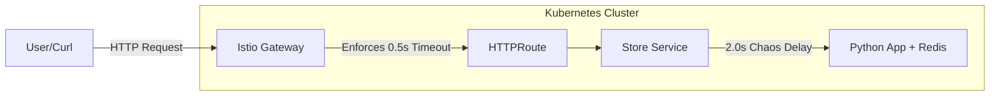

# 🛡️ Resilience Store: Chaos Engineering with Istio Ambient Mesh


A demonstration of **Resilient Microservices Architecture** on Kubernetes. This project builds a Python Flask application and uses **Istio Ambient Mesh** to enforce safety limits (Timeouts) against network failures simulated by **Chaos Mesh**.

---

## 🏗️ Architecture

Traffic flows through the system in the following stages:

1.  **User Request** (`curl`) hits the **Istio Ingress Gateway**.
2.  **Gateway API Route** enforces a strict **0.5s Timeout**.
3.  Traffic is forwarded to the **Resilience Store Service**.
4.  **Chaos Mesh** intercepts the packet and injects a **2.0s Latency** (Simulating a slow network/database).
5.  **Result:** The Istio Gateway cuts the connection at 0.5s, returning a `504 Gateway Timeout` instead of letting the user wait indefinitely.



---

## 📂 Project Structure

```text
resilience-store/
├── app/
│   ├── app.py                 # Flask Microservice
│   ├── Dockerfile             # Container definition
│   └── requirements.txt       # Python dependencies
├── k8s/
│   ├── deployment.yaml        # App & Redis Deployment
│   └── service-fix.yaml       # Kubernetes Service (Maps Port 8080 -> 5000)
├── istio/
│   ├── fix-ingress.yaml       # Istio Gateway Configuration
│   └── final-route.yaml       # HTTPRoute with Timeout Logic
└── chaos/
    └── chaos-delay.yaml       # NetworkChaos definition (2s Latency)
```

---

## 🚀 Prerequisites

* **Minikube** (Kubernetes Cluster)
* **Docker**
* **Istio** (Installed with `ambient` profile)
* **Chaos Mesh** (Installed via Helm or script)
* **Gateway API CRDs** (Experimental version required for Timeouts)

```bash
# Install Gateway API Experimental CRDs
kubectl apply -f [https://github.com/kubernetes-sigs/gateway-api/releases/download/v1.1.0/experimental-install.yaml](https://github.com/kubernetes-sigs/gateway-api/releases/download/v1.1.0/experimental-install.yaml)
```

---

## 🛠️ Installation & Setup

### 1. Build the Application
Point your terminal to Minikube's Docker daemon and build the image locally.
```bash
eval $(minikube docker-env)
docker build -t resilience-store:v1 ./app
```

### 2. Deploy Kubernetes Resources
Deploy the application and the fixed service.
```bash
kubectl apply -f k8s/
```

### 3. Configure Istio Mesh
Enable Ambient mode and deploy the Gateway/Routes.
```bash
kubectl label namespace default istio.io/dataplane-mode=ambient
kubectl apply -f istio/
```

### 4. Verify Access
Get the Gateway URL provided by Minikube.
```bash
minikube service store-gateway-istio --url
# Example output: [http://127.0.0.1:39049](http://127.0.0.1:39049)
```

Run a baseline test (Should return `200 OK`):
```bash
curl -v -X POST http://<YOUR_IP>:<YOUR_PORT>/buy
```

---

## 💥 The Chaos Experiment

Now we simulate a production failure where the database becomes unresponsive.

### 1. Apply Network Latency
Inject a **2.0 second delay** into all traffic reaching the store.
```bash
kubectl apply -f chaos/chaos-delay.yaml
```

### 2. Verify Resilience (The Fix)
The application *wants* to wait 2 seconds, but our Istio policy forbids requests longer than 0.5 seconds.

Run the test again:
```bash
curl -v -X POST http://<YOUR_IP>:<YOUR_PORT>/buy
```

**Expected Result:**
```text
< HTTP/1.1 504 Gateway Timeout
< server: istio-envoy
```
*The system successfully failed fast, preventing resource exhaustion.*

---

## 🧹 Cleanup

To remove all resources and stop the experiment:

```bash
kubectl delete -f chaos/
kubectl delete -f istio/
kubectl delete -f k8s/
```